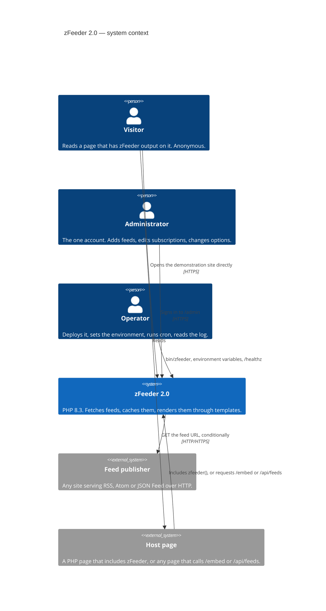
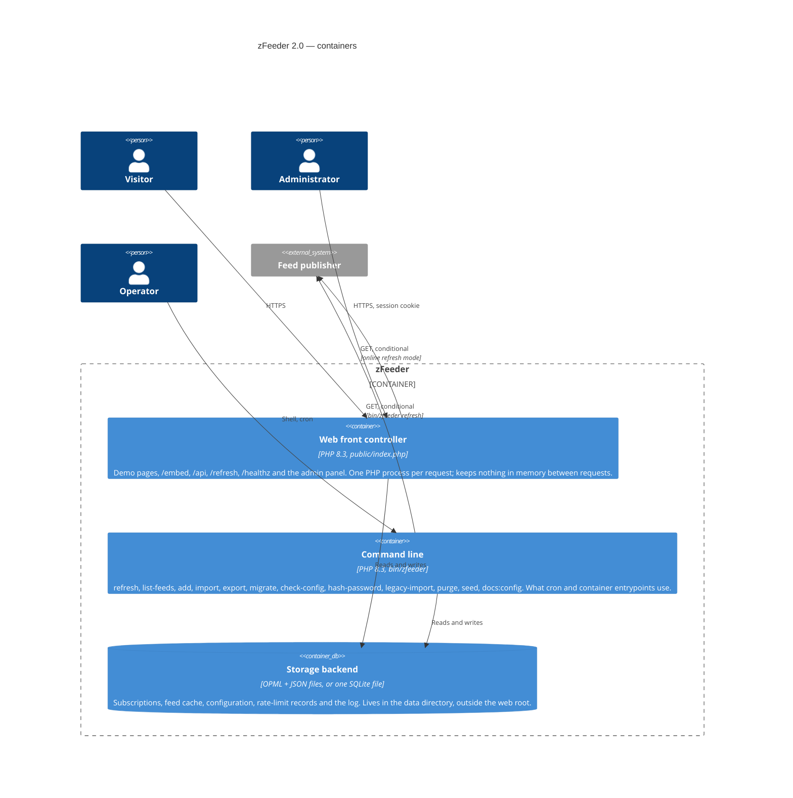
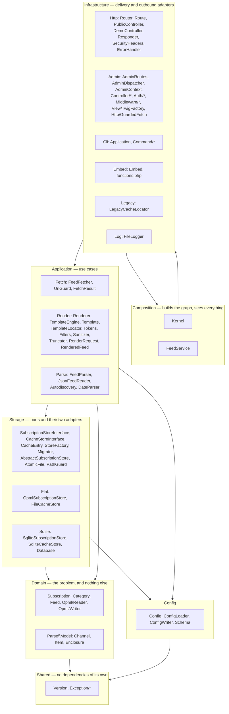

# Architecture

How zFeeder 2.0 is put together, and why it is put together that way.

This document describes the code in `src/`. For what the options mean see
[CONFIGURATION.md](CONFIGURATION.md); for the template format see
[TEMPLATES.md](TEMPLATES.md); for the security argument see
[THREAT-MODEL.md](THREAT-MODEL.md); for the decisions and the alternatives that
were rejected see [adr/](adr/).

## Contents

- [System context](#system-context)
- [Containers](#containers)
- [Components](#components)
- [Request lifecycles](#request-lifecycles)
- [Two deliberate resilience behaviours](#two-deliberate-resilience-behaviours)
- [Storage](#storage)
- [No framework, no container, no ORM](#no-framework-no-container-no-orm)
- [What was kept from 2004 and what was replaced](#what-was-kept-from-2004-and-what-was-replaced)
- [Extension points](#extension-points)

## System context

zFeeder sits between three kinds of people and the feeds they want to read.



The trust position is the important part of this picture. The visitor is
anonymous and the feed publisher is not controlled by anyone in the diagram, so
everything arriving from a publisher is treated as hostile input and everything
arriving in a query string is validated before it touches a path.

> **The pictures also exist on their own.** Every diagram in this document, plus six more
> — the request lifecycle, the render pipeline, the storage ports, the trust boundaries,
> the deployment topology and a 1.6-to-2.0 comparison — is in
> [diagrams/](diagrams/README.md) as Mermaid source and as SVG.

## Containers

There are four things that run or hold state, and no more than four.



Both processes build the same object graph through `Zfeeder\Kernel`, so a feed
fetched by cron and a feed fetched while rendering go through identical code.
The storage backend is a choice at runtime, not at build time: `ZF_STORAGE=flat`
or `ZF_STORAGE=sqlite` picks it, and `Zfeeder\Storage\StoreFactory` is the only
place in the program that names a concrete store.

There is deliberately no fourth process. No queue, no worker, no cache server.
A refresh is a loop over subscriptions in one process, which is what makes the
shared-hosting deployment in [DEPLOYMENT.md](DEPLOYMENT.md) possible.

## Components

`deptrac.yaml` defines seven layers and the CI job **Architecture boundaries**
fails the build when a dependency runs the wrong way. The listing below is
grouped by those layers, and the arrows in the diagram are exactly the ruleset
in that file.



Layer by layer:

| Layer | Contents | May depend on |
|---|---|---|
| Shared | `Zfeeder\Version`, `src/Exception/*` (`ZfeederException` and its six subclasses) | nothing |
| Domain | `src/Subscription/*` (`Category`, `Feed`, `Opml\Reader`, `Opml\Writer`), `src/Parse/Model/*` (`Channel`, `Item`, `Enclosure`) | Shared |
| Config | `src/Config/*` (`Config`, `ConfigLoader`, `ConfigWriter`, `Schema`) | Shared |
| Storage | `src/Storage/*`, both adapters | Shared, Domain, Config |
| Application | `src/Fetch/*`, `src/Render/*`, and the non-model classes of `src/Parse/` | Shared, Domain, Config, Storage |
| Infrastructure | `src/Http/*`, `src/Admin/*`, `src/Cli/*`, `src/Embed/*`, `src/Legacy/*`, `src/Log/*` | everything, including Composition |
| Composition | `Zfeeder\Kernel`, `Zfeeder\FeedService` | everything |

Two things in the table are worth explaining.

`Config` is its own layer rather than part of Domain because nearly everything
reads it and it reads nothing itself. Making it a peer of Domain keeps Domain
free of a dependency it does not need.

`src/Parse/` is split across two layers: `Parse\Model` is Domain, because a
`Channel` is the normalised shape the whole program agrees on, while
`FeedParser`, `JsonFeedReader`, `Autodiscovery` and `DateParser` are Application,
because they are the act of turning bytes into that shape. The deptrac collector
for Application uses the regex `#^Zfeeder\\Parse\\(?!Model)[A-Za-z]+$#` to draw
exactly that line.

`src/Embed/functions.php` is excluded from deptrac, because it declares plain
global functions rather than a class and there is nothing for a class-based
collector to see.

## Request lifecycles

### A rendered demonstration page

`GET /demos/one-line?set=modern`

| # | Where | What happens |
|---|---|---|
| 1 | `public/index.php` | `ServerRequestCreator::fromGlobals()` builds a PSR-7 request through `Nyholm\Psr7`. |
| 2 | `public/index.php` | `Kernel::boot(null, dirname(__DIR__))` → `ConfigLoader::load()` merges schema defaults, `data/config.json` and the environment, validates every value and refuses a data directory inside the web root. A failure here prints one line and stops; no trace reaches the client. |
| 3 | `public/index.php` | If `demo_enabled` is false, a 503 "paused" page is emitted and nothing else runs. |
| 4 | `Http\Router::dispatch()` | Routes are matched in order; `/demos/{slug}` yields handler `demo.show` with `params['slug'] = 'one-line'`. |
| 5 | `Http\DemoController::demo()` | Looks the slug up in its `DEMOS` table, builds a `Render\RenderRequest` and calls `Kernel::feeds()`. |
| 6 | `FeedService::render()` | `resolveCategory()` validates the requested name with `Category::isValidName()` and falls back to `default_category`, then to the first existing category, exactly as 1.6 fell back. |
| 7 | `FeedService::load()` | For each `Category::renderableFeeds()`: in `online` mode `Fetch\FeedFetcher::fetch()`, in `offline` mode `CacheStoreInterface::get()` only. |
| 8 | `Fetch\FeedFetcher::fetch()` | Fresh cache entry → returns `FetchResult::NOT_EXPIRED` without a socket. Otherwise `UrlGuard::assertAllowed()`, then `followRedirects()` and `readBounded()`. The request carries `User-Agent` and `Accept` and no `Accept-Encoding`; see [Two deliberate resilience behaviours](#two-deliberate-resilience-behaviours). |
| 9 | `FeedService::parseQuietly()` | `Parse\FeedParser::parse()` → `Parse\Model\Channel`. A throw is logged and becomes a null channel; one broken feed never takes the page down. A null channel from a **cached** body additionally triggers the one-shot refetch described below. |
| 10 | `Render\Renderer::render()` | `TemplateLocator::resolve('modern/cards')` → `TemplateEngine::load()` → `Template`. Then the 1.6 output loop: page header, then per feed `header`, channel bar, news items, `footer`, `between`. |
| 11 | `Render\Tokens::substitute()` | The 2.0 pass runs first over the template text, then `Renderer::renderChunk()` performs 1.6's sequential `str_replace()` calls. `Render\Sanitizer` and `Render\Truncator` have already reduced the item body. |
| 12 | `Http\SecurityHeaders::forPublic()` | CSP, `X-Content-Type-Options`, `Referrer-Policy`, `Permissions-Policy`, `Cross-Origin-Opener-Policy`, and HSTS when the request is HTTPS. |
| 13 | `zfeeder_emit()` in `public/index.php` | Status, headers and body are written to the SAPI in 8 KiB chunks. |

One caveat about step 2 that is worth knowing before you deploy. The JSON
configuration file is looked for at `<project root>/data/config.json`
(`ConfigLoader::DEFAULT_CONFIG_RELATIVE`), and that path is **not** derived from
`data_dir`. Setting `ZF_DATA_DIR` moves the subscriptions, the cache and the log
but not the configuration file, so a `config.json` placed in the data directory
is not read. Verify what is actually in use with `bin/zfeeder check-config`,
which prints the config file path it resolved. See
[DEPLOYMENT.md](DEPLOYMENT.md) for what this means on a platform with a mounted
volume.

Two routes deliberately skip the header layer: `public.health` and
`public.refresh` are returned from `public/index.php` without passing through
`SecurityHeaders`, because neither is a document a browser renders. They
therefore carry no content security policy and no `X-Zfeeder-Version`.

### `/embed`

`GET /embed?category=news&template=modern/list`

Steps 1 to 3 are identical. From there:

| # | Where | What happens |
|---|---|---|
| 4 | `Http\Router::dispatch()` | Handler `public.embed`. `OPTIONS /embed` is a separate route, handler `public.preflight`. |
| 5 | `Http\PublicController::embed()` | `requestFrom()` reads both spellings of each parameter: `category` or `zfcategory`, `template` or `zftemplate`, `position` or `zfposition`, `more` or `zfmore`, `link` or `zf_link`. `selfUrl` is fixed to `/embed` so `{moreurl}` and `{hideurl}` point back at the endpoint. |
| 6 | `FeedService::render()` | Identical to steps 6–11 above. The response is an HTML **fragment**: no document, no `<head>`, nothing to conflict with the host page. |
| 7 | `Http\SecurityHeaders::forEmbed()` | Applies `forPublic()`, then adds `Access-Control-Allow-Origin` **only** when the request's `Origin` header appears in `embed_cors_origins`. `frame-ancestors` comes from `embed_frame_ancestors` and defaults to `'self'`. |

`GET /api/feeds` follows the same path but calls `PublicController::api()`,
which returns the parsed `Channel` objects as JSON, truncated to each
subscription's `showedItems`, and returns 404 when `api_enabled` is off.

### `bin/zfeeder refresh`

| # | Where | What happens |
|---|---|---|
| 1 | `bin/zfeeder` | Refuses to run outside the CLI SAPI, finds `vendor/autoload.php` (repository layout or installed-as-a-dependency layout), and boots the kernel. A configuration error exits 78. |
| 2 | `Cli\Application::__construct()` | Registers the twelve commands, each holding the same `Kernel`. |
| 3 | `Cli\Command\RefreshCommand::execute()` | Validates `--category` against `SubscriptionStoreInterface::has()`; an unknown name returns exit code 2. |
| 4 | `RefreshCommand::acquireLock()` | An exclusive lock on `refresh.lock` in the data directory. A held lock is **not** an error: the message says another run is in progress and the exit code is 0, so cron stays quiet. |
| 5 | `FeedService::refresh()` | Iterates the named category or every category, skipping a URL already seen in this run, and calls `FeedFetcher::fetch($url, $refreshMinutes, $force)`. |
| 6 | `Fetch\FeedFetcher` | Same guard, redirect and size rules as the web path. A 304 rewrites the entry's `fetchedAt` and clears any recorded error; a failure keeps the stale body and records why. |
| 7 | `RefreshCommand` | Prints one `FetchResult::legacyLine()` per feed — the 1.6 wording, byte for byte — or a JSON report with `--json`. Exit code 1 when at least one feed failed. |

## Two deliberate resilience behaviours

Both are in the fetch path, both look like something to tidy away, and both are
there because of a failure that happened.

### `Accept-Encoding` is never set by hand

`FeedFetcher::requestHeaders()` sends `User-Agent` and `Accept` and nothing else.
Adding `Accept-Encoding: gzip` — the obvious optimisation, and what 1.6 would
have needed — tells the transport that the caller will deal with the encoding,
so curl stops decompressing transparently. The body then reaches
`Parse\FeedParser` still gzipped and every feed fails with `Start tag expected`.
Leaving the header off lets the client negotiate compression and decode it,
which is what this code wants: publishers still serve gzip, and the bytes that
reach the parser are the feed.

This is a production failure, not a hypothetical: every feed on the deployed
instance went blank at once, and the symptom pointed at the parser rather than
at the header that caused it. The comment in `requestHeaders()` is there so the
line is not re-added.

### A cached body that will not parse is discarded and refetched once

```
FeedService::loadOne()
  ├─ fetch → FetchResult::NOT_EXPIRED, entry from cache
  ├─ parseQuietly(entry.body) → null
  ├─ outcome is NOT_EXPIRED and $forceRefresh is false
  │    ├─ logger->notice('Discarding an unparseable cache entry …')
  │    ├─ cache->delete(url)
  │    └─ fetch(url, …, force: true)   ← exactly one retry
  └─ RenderedFeed with whatever that produced
```

Without this, a damaged cache entry leaves the feed blank until its refresh
interval expires, which can be hours, and nothing short of `purge` fixes it. A
damaged entry is more likely than a broken publisher: a truncated write, or a
body stored by an older version that encoded it differently.

The retry is bounded by two conditions. It runs only when the entry came from
the cache rather than from the network, so a publisher that is genuinely serving
malformed XML is not fetched twice for the same failure; and it runs only when
the caller did not already ask for a forced refresh, so `bin/zfeeder refresh
--force` cannot loop. The cost of a genuinely malformed feed is one extra
request per refresh interval, not one per page view.
`Integration\Http\FeedServiceTest::testAnUnparseableCacheEntryIsDiscardedAndRefetchedOnce`
and `testAFeedThatIsGenuinelyBrokenIsNotRefetchedRepeatedly` pin both.

## Storage

### The ports

Two interfaces, in `src/Storage/`:

```php
interface SubscriptionStoreInterface {
    public function categories(): array;              // list<string>, sorted
    public function has(string $name): bool;
    public function category(string $name): Category;
    public function saveCategory(Category $category): void;
    public function createCategory(string $name): void;
    public function deleteCategory(string $name): void;
    public function exportOpml(string $name): string;
    public function importOpml(string $name, string $opml, bool $replace): int;
}

interface CacheStoreInterface {
    public function get(string $url): ?CacheEntry;
    public function put(CacheEntry $entry): void;
    public function delete(string $url): void;
    public function purge(int $olderThanSeconds): int;
    public function urls(): array;                    // list<string>
}
```

`exportOpml()` is on the subscription port rather than on the flat adapter on
purpose: OPML is the interchange format of the product, so a SQLite installation
must be able to hand its subscriptions back as OPML without converting itself
first.

Shared behaviour lives in `Storage\AbstractSubscriptionStore`, so both adapters
enforce the same category-name rule (`Category::NAME_PATTERN`,
`/^[a-z0-9_-]{1,40}$/`) and the same import limits.

### The flat adapter

`Storage\Flat\OpmlSubscriptionStore` keeps one OPML 2.0 file per category in
`categories_dir`, named after the category. `Storage\Flat\FileCacheStore` keeps
one file per feed body, named `sha256(url)`, with a sidecar JSON file holding the
ETag, the `Last-Modified` value, the fetch time, the status and any recorded
error.

Every write goes through `Storage\AtomicFile`: a uniquely named temporary file in
the same directory, an exclusive lock on a `.lock` sibling, then `rename()` over
the target. Directories are created `0750` and files `0640`.
`Storage\PathGuard::assertInside()` re-checks, with `realpath()`, that the file
that is about to be opened really lives under the configured directory — the
second lock on a door the name pattern has already closed.

`Legacy\LegacyCacheLocator` can still find a body in a 1.6 cache directory, where
the file name was `preg_replace('/[^a-zA-Z0-9]/', '_', $url) . '.xml'`. It reads
that layout and never writes it: the 2004 scheme is not injective, and it puts
the feed URL into the file name.

### The SQLite adapter

`Storage\Sqlite\Database` opens the file through PDO, turns foreign keys on, and
applies the migrations in `src/Storage/Sqlite/Migrations/` in order, recording
what has run. `StoreFactory::database()` creates that connection once and hands
it to both stores, so a request opens one file handle and one write-ahead log
rather than two.

`src/Storage/Sqlite/Migrations/001_initial.sql` is the schema as it stands:

| Table | Column | Type | Notes |
|---|---|---|---|
| `categories` | `name` | `TEXT PRIMARY KEY` | the category name, same pattern as the flat file name |
| | `date_modified` | `INTEGER` | OPML `dateModified`, as a Unix timestamp |
| | `owner_name` | `TEXT` | OPML head |
| | `owner_email` | `TEXT` | OPML head |
| `feeds` | `id` | `INTEGER PRIMARY KEY AUTOINCREMENT` | |
| | `category` | `TEXT NOT NULL` | `REFERENCES categories(name) ON DELETE CASCADE` |
| | `position` | `INTEGER` | the OPML `position` attribute; render order |
| | `title` | `TEXT` | |
| | `xml_url` | `TEXT NOT NULL` | the feed URL, and the cache key |
| | `html_url` | `TEXT` | |
| | `description` | `TEXT` | |
| | `language` | `TEXT` | |
| | `refresh_minutes` | `INTEGER` | OPML `refreshTime` |
| | `showed_items` | `INTEGER` | OPML `showedItems` |
| | `subscribed` | `INTEGER` | OPML `isSubscribed` |
| `cache` | `url` | `TEXT PRIMARY KEY` | |
| | `body` | `BLOB` | the feed as it arrived |
| | `fetched_at` | `INTEGER` | Unix timestamp; the TTL is measured from here |
| | `etag` | `TEXT` | for `If-None-Match` |
| | `last_modified` | `TEXT` | for `If-Modified-Since`, kept as the server wrote it |
| | `status` | `INTEGER` | the HTTP status of the stored body |
| | `error` | `TEXT` | why the last refresh failed, when it did |

Indexes: `feeds_category_position` on `feeds (category, position)` and
`cache_fetched_at` on `cache (fetched_at)`.

One more table exists and is not in that file: `schema_version (version INTEGER
NOT NULL)`, created by `Storage\Sqlite\Database::migrate()` before the first
migration runs, so that the migration runner has somewhere to record progress.
`Database` also sets `journal_mode = WAL`, `foreign_keys = ON` and
`busy_timeout = 5000` on every connection.

The columns are the OPML attributes and the conditional-request metadata, one
for one. That is intentional: the two adapters must be interchangeable, and a
schema that modelled something richer than OPML could not be exported back to
it. `Storage\Migrator` copies in either direction and then re-reads the
destination and compares counts, because "the writes did not throw" is not the
same as "the data is there".

## No framework, no container, no ORM

### No framework

The product's oldest promise is that one line of PHP in an existing page prints
the feeds. A framework owns the request, the front controller and often the
autoloading order, and a page that only wants one line cannot hand any of that
over. `Zfeeder\Embed\Embed` has to work when it is included halfway down
somebody else's `index.php`, and that rules out inheriting from a kernel.

What replaces it is small and specific. `Http\Router` is a list of routes matched
in order, 77 lines; there are roughly twenty routes, and a compiled dispatcher
would be faster in a way no one could measure next to a single feed fetch.
`Admin\Middleware\Pipeline` runs PSR-15 middleware and then the controller in 46
lines, for the three middleware `AdminDispatcher` assembles —
`SecurityHeadersMiddleware`, `DemoMode` and, for everything but the login form,
`RequireAuth` — and one handler.
PSR-7 (`nyholm/psr7`) and PSR-15 are used as interfaces, so the pieces are
replaceable without being owned.

The parts that are genuinely hard are not written here: `laminas/laminas-feed`
reads the feed formats, `symfony/http-client` does HTTP, `symfony/html-sanitizer`
does the allow-list, `twig/twig` renders the admin panel and
`symfony/console` runs the CLI.

### No container

`Zfeeder\Kernel` is a hand-written factory. There are about fifteen services, the
graph is fixed, and each is created once and lazily by a method that reads
`$this->x ??= new X(...)`. A container would add a dependency, a configuration
format and a layer of indirection to solve a problem this size does not have, and
it would make the wiring harder to read — which matters, because the wiring is
where the security-relevant choices live. The `max_redirects: 0` on the HTTP
client in `Kernel::httpClient()` is the whole reason `FeedFetcher` can re-check
every redirect hop, and that is one line in a method, not an entry in a service
file.

The cost is that tests cannot ask a container for a replacement. That is paid for
explicitly: `Kernel::withHttpClient()`, `withSubscriptions()`, `withCache()` and
`withLogger()` are named test seams that reset the services they invalidate, and
the constructor takes an optional clock so every time-dependent decision can be
pinned.

### No ORM

There are three tables and no relationships beyond one foreign key. The queries
are written as prepared statements in `Storage\Sqlite\SqliteSubscriptionStore`
and `SqliteCacheStore`. An ORM would earn its keep against a schema that changes
under it; here the schema is fixed by the OPML attribute set, which has not
changed since 2000.

More decisively, SQLite is one of two backends and the other one is a directory
of XML files. An ORM would only ever serve half the installations, so the
abstraction that matters is `SubscriptionStoreInterface` — which both backends
implement and one abstract test case
(`tests/Support/SubscriptionStoreContractTestCase.php`, and
`CacheStoreContractTestCase.php` for the cache) is run against both.

## What was kept from 2004 and what was replaced

| 1.6 | 2.0 | Why |
|---|---|---|
| One-line include, `include("newsfeeds/zfeeder.php")` | Kept. `zfeeder.php` at the repository root still prints its output; `zfeeder()`, `zfeeder_echo()` and `zfeeder_feeds()` are the function surface | It is the product's distinguishing feature |
| OPML files as the subscription store, one per category | Kept as the flat backend and as the interchange format. 1.x files load unchanged | Subscriptions outlive installations |
| Section markers `<!-- header -->` … `<!-- ENDheader -->` and the `substr()` rule | Kept byte for byte in `Render\TemplateEngine`, including the quirk that the opening marker is printed and the closing one is not | 2004 templates must still render |
| The fifteen `{token}` names | Kept, in 1.6's replacement order, in `Render\Tokens::LEGACY`. Nine tokens added, none removed | Removing a token breaks somebody's template |
| Per-feed TTL from the OPML `refreshTime` | Kept, in `Storage\CacheEntry::isExpired()` | |
| Stale content on a fetch failure | Kept. `FeedFetcher::failure()` returns the old entry and records the error | An aggregator showing yesterday's headlines beats one showing an empty column |
| Online refresh while rendering, or an offline refresh with a key | Kept. `refresh_mode`, and `/refresh?key=` for hosts without cron | |
| Query parameters `zfcategory`, `zftemplate`, `zfposition`, `zfmore`, `zf_link` | Kept, and validated. Unprefixed aliases added on `/embed` | |
| `{moreurl}` / `{hideurl}` link construction | Kept, including the `&amp;` in the query string | Golden output depends on it |
| Offline refresh report wording | Kept, in `FetchResult::legacyLine()` | Sites have scripts that read those lines |
| "Powered by zFeeder" | Kept, the same bytes, in `Renderer::POWERED_BY`; switchable with `powered_by` | |
| Unsalted `md5($password)` in `config.php` | **Replaced.** Argon2id through `Admin\Auth\PasswordHasher`, stored in JSON | Two defects in one line: a GPU-trivial digest, and a credential inside executable code |
| `config.php` rewritten from `$_POST` | **Replaced.** `Config\ConfigWriter` writes `data/config.json` atomically; `Config\Schema` rejects unknown keys | PHP written by PHP from request data is remote code execution with extra steps |
| `$_GET['zfcategory']` concatenated into a path | **Replaced.** `Category::NAME_PATTERN`, then `Storage\PathGuard` with `realpath()` | Directory traversal |
| `$_GET['zftemplate']` concatenated into a path | **Replaced.** `Render\TemplateLocator` validates the set, the name pattern and the resolved path | Same |
| `fopen($url, 'r')` for fetching | **Replaced.** `symfony/http-client` behind `Fetch\UrlGuard`, with the scheme allow-list, every resolved address checked, each redirect hop re-checked, a byte ceiling and a timeout | `fopen()` accepted `file://` and `php://` and followed redirects blindly |
| `<description>` printed straight into the page | **Replaced.** `Render\Sanitizer` (allow-list) and `Render\Truncator` | Any subscribed feed could run script on the host site |
| Server HTTP Basic auth as a login option | **Replaced.** Session login only; HTTP auth is left to the web server | The panel should not implement two authentication systems |
| WAP/WML output (`wap.php`, `demo_wap.wml`) | **Removed** | The transport it targeted no longer exists |
| Frames demo (`demo_frames.php` and its two frame pages) | **Replaced** by a CSS grid page, `DemoController::aggregator()` | Same layout, no frames |
| Expat SAX parser reading into globals | **Replaced.** `Parse\FeedParser` on `laminas/laminas-feed` plus a direct DOM pass, into `Channel` and `Item` | Untestable, and it could not tell one format from another |
| Cache files at mode `0766`, data inside the web root | **Replaced.** `0640` files, `0750` directories, and a boot-time check that refuses a data directory under `public/` | |
| Update check by `readfile()` of a remote PHP page | **Replaced.** `update_check` is off by default; `Admin\Controller\UpdatesController` | Reading remote PHP into an admin page is a supply chain hole |

## Extension points

### A template

Drop an HTML file into `templates/classic/` or `templates/modern/`. The name must
match `/^[a-z0-9_-]{1,40}$/i` and the file must contain the five section marker
pairs `header`, `channel`, `news`, `footer`, `between`; the once-per-page
`zFeeder template header` section is optional. `TemplateLocator::available()`
picks it up with no registration step, so it appears in the demo gallery and in
the admin template list immediately. Full reference: [TEMPLATES.md](TEMPLATES.md)
and [templates/README.md](../templates/README.md).

A new template set — a third directory beside `classic` and `modern` — is not an
extension point: `TemplateLocator::SETS` is a closed list, and the admin skin
names, the CSS and the demo switcher all assume two.

### A storage backend

1. Implement `Storage\SubscriptionStoreInterface` and `Storage\CacheStoreInterface`.
   Extending `Storage\AbstractSubscriptionStore` gives you the name validation and
   the import limits for free.
2. Add the backend's name to the `storage` enum in `Config\Schema::all()`.
3. Add one branch to `Storage\StoreFactory::subscriptions()` and one to
   `StoreFactory::cache()`. Nothing else in the program names a concrete store.
4. Subclass `tests/Support/SubscriptionStoreContractTestCase.php` and
   `tests/Support/CacheStoreContractTestCase.php`. If both pass, `Storage\Migrator`
   can move data in and out of your backend without further work.

### A CLI command

Write a `Symfony\Component\Console\Command\Command` subclass in
`src/Cli/Command/` with an `#[AsCommand]` attribute, take `Zfeeder\Kernel` in the
constructor, and add it to the `addCommands()` list in `Cli\Application`. The
`Cli\Command\CommandInput` trait has the typed option and flag readers the other
commands use. Commands must be idempotent: cron will run them again.

### A feed format

`Parse\FeedParser::parse()` dispatches on content. JSON goes to
`Parse\JsonFeedReader`; everything else is checked for a document type
declaration, imported through `laminas/laminas-feed`, and then mapped from the
DOM by format. To add a format:

1. Recognise it in `FeedParser::parse()` or in `FeedParser::formatOf()`.
2. Map it onto `Parse\Model\Channel` and `Parse\Model\Item`. Nothing downstream
   knows about formats; the renderer and both endpoints only see the model.
3. Add its media type to `Parse\Autodiscovery::FEED_TYPES` if pages declare it
   with a `<link rel="alternate">`.
4. Add a fixture under `tests/fixtures/feeds-2004/` or `tests/fixtures/feeds-2026/`
   and a case to `tests/Unit/Parse/FeedParserTest.php`.

Formats currently mapped: RSS 0.9x, RSS 1.0 (RDF), RSS 2.0, Atom 1.0 and JSON
Feed 1.1.
