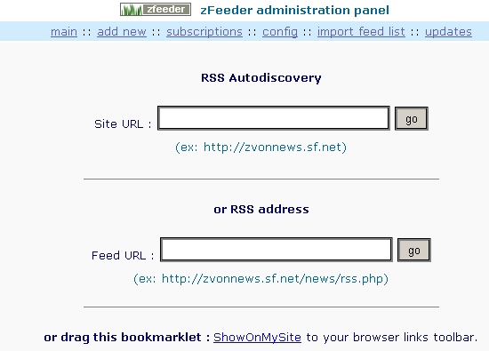
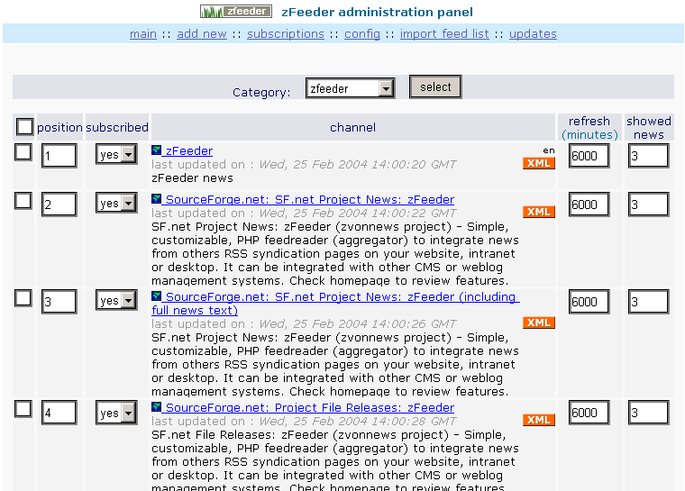
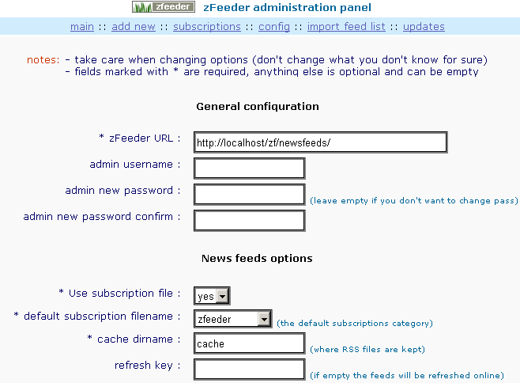
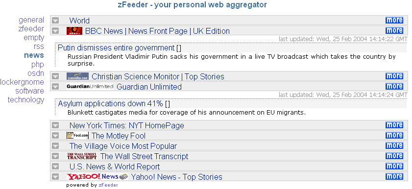

# The history of zFeeder

zFeeder is a PHP script for displaying RSS/RDF newsfeeds on a website, in a WAP page, or on a desktop
through a browser. It was written by Andrei N. Besleaga (SourceForge username `andreutz`) starting in
2003, released under the GNU GPL, and hosted as the SourceForge project `zvonnews`
(<https://sourceforge.net/projects/zvonnews/>). Development stopped at version 1.6 in April 2004. This
document is the history of that project and the reason it is being rebuilt, twenty-two years later, in
this repository (<https://github.com/andreibesleaga/zfeeder>).

## Syndication before there was a standard way to do it

In 2003 "RSS" did not mean one thing. Userland's RSS 0.90 and 0.91, the RDF-based RSS 1.0 from the RSS-DEV
working group, and Dave Winer's RSS 2.0 were all in circulation at once, produced by different publishers
for different reasons, and none of them fully compatible with the others at the parser level. A site that
wanted to show someone else's headlines had to pick a parsing strategy that tolerated all of these
dialects, because it had no way of knowing in advance which one a given feed would use. There was no
dominant aggregator, desktop or web-based, and no accepted way to move a list of subscriptions between the
handful that existed — which is exactly the gap OPML (Outline Processor Markup Language) was invented to
fill. Most sites that wanted feed content simply hand-rolled something: a short PHP script that fetched an
XML file with `fopen()` and ran a handful of string or regex operations over it.

zFeeder started as one of those hand-rolled scripts and grew into a general-purpose one. Its first name was
zvonFeeds, released as 1.0 and then 1.1.0; it was renamed to zFeeder for the 1.0 release under that name
(the readme's own history section records both renames: "zvonFeeds 1.0 renamed to zFeeder 1.0, zvonFeeds
1.1.0 renamed to zFeeder 1.1"). The SourceForge project was registered on 27 June 2003. A sibling project,
zShaped, existed alongside it and hosted zFeeder's project site.

## What it did, and why those choices made sense in 2004

zFeeder's design decisions were shaped by the hosting environment of the time, not by taste:

- **Flat text files instead of a database.** Shared PHP hosting in 2003–2004 frequently did not include a
  MySQL database, or metered it separately, while every plan gave you a writable directory. Storing
  subscriptions as OPML and cached items as flat files meant zFeeder needed nothing beyond PHP itself and
  the `expat` XML extension that shipped with it — the requirements section of the 1.6 readme states this
  plainly: PHP ≥ 4.2.0 with `expat` compiled in, "MUST allow outbound connections to other sites."
- **OPML as the subscription format.** OPML was, at the time, close to the only interchange format for
  lists of feed subscriptions that other tools also understood. Using it for the category files meant a
  user's subscriptions could be exported to or imported from another aggregator, and zFeeder's own admin
  panel supported importing an OPML list directly (including, as a documented trick, importing search
  results from Feedster as an OPML feed list).
  In zFeeder, one OPML file was one "category": each site or blog owner typically ran several categories at
  once (for example a default set and a "news" or "technology" set) and could show any of them, or several
  side by side, on different pages.
- **Templates instead of a fixed layout.** Every site that embedded zFeeder looked different, so the output
  could not be a fixed block of HTML. Templates were split into `header`, `channel`, `news`, `footer` and
  `between` sections with `{token}` placeholders (`{chantitle}`, `{link}`, `{description}`, `{pubdate}`,
  and so on) substituted at render time. The script shipped with ten of these templates plus CSS variants,
  and let CSS-only templates be built (`RiJ` was one, contributed by a user).
- **Everything through one include line.** The documented way to use zFeeder was
  `<? include('newsfeeds/zfeeder.php'); ?>` on any PHP page, optionally with `zftemplate`, `zfposition`,
  `zfcategory` and `zfmore` parameters to control what showed where. This made it trivial to drop feed
  content into an existing site without restructuring it.
- **Online or offline refresh.** Up to and including 1.2, feeds refreshed inline on every page load if
  their cache had expired, which could make a page slow or, with many feeds, time out. 1.3 added offline
  refresh: a `REFRESH_KEY` plus a `zfrefresh` request parameter that a cron job (via `wget`, `lynx`, or a
  PHP CLI call) could hit on a schedule, so visitor page loads never triggered a fetch.
- **WAP/WML output.** `wap.php` rendered the same subscriptions as WML for the WAP-capable phones that were
  still a meaningful share of "the mobile web" in 2004, with a separate set of `wap_*` templates and a
  documented workaround for feeds containing `&` in their content.
- **RSS autodiscovery and a bookmarklet.** zFeeder implemented autodiscovery of a feed URL from a site's
  `<link rel=alternate>` tag (crediting Keith Devens' technique), and shipped a browser bookmarklet that
  sent whatever page you were looking at straight to the admin panel's "add new" screen.

## How it spread

zFeeder had no marketing budget and no company behind it; its distribution was entirely through
SourceForge, word of mouth, and the fact that it was simple enough to install in a few minutes. The
project's own references page listed dozens of sites running it, from personal blogs and hobby sites to
organisation pages, and a handful of testimonials quoted directly on that page ("A few simple PHP scripts,
some easily modified templates and I got it going on twenty minutes later" — FultonChain; "It's a great
little tool, thanks for making it available!" — Peter Kent).

Three things did the most for its reach beyond SourceForge itself:

- **The INTERNET PROFESSIONELL article.** In its August 2004 issue, the German magazine INTERNET
  PROFESSIONELL (VNU Business Publications) ran a three-page article about zFeeder as part of a larger
  piece on RSS, covering installation, administration, usage, and its WAP support. The script also shipped
  on the issue's listings CD — by the author's own account, the first magazine to include it on a CD.
- **Third-party modules and integrations.** A WordPress module was released by a user known as Bakshi; a
  PHP-Nuke module was built at NukeDiva; zFeeder was integrated directly into XHP (eXpandable Home Page), a
  personal-homepage CMS of the period; and a user named Elise wrote a how-to for displaying zFeeder feeds
  on a MovableType site. Each of these extended zFeeder's reach into a community the author had not
  targeted directly.
- **User-contributed templates.** At least one template, `RiJ`, a pure-CSS layout, was contributed by a
  user rather than written by the author, and the project's news explicitly invited people to share
  templates, modules and fixes "so that it can be shared with everyone."

The author's own account is that zFeeder was, over its lifetime, deployed on more than 20,000 websites.
This is the author's own count and recollection, not an independently audited figure, but it is his to
state about his own project, and it is stated here plainly because it is the honest scale the rest of this
history should be read against: a script two people could have written in a weekend, seen by tens of
thousands of site owners.

## What happened to it

A news item dated 12 September 2004, titled "1 year," marks the point where the author describes
development as "currently on standby, frozen on version 1.6" — a decision made openly on the project's own
site rather than announced later. No further versions were released after 1.6 (25 April 2004). The
`zvonnews` project page on SourceForge is still reachable today, last touched in 2017 according to the
provenance notes kept with this repository's recovered screenshots, but the project's own website
(`http://zvonnews.sourceforge.net`, hosted on SourceForge's now-retired project web space) eventually went
offline. What survives is the SourceForge project listing itself, Internet Archive captures of the project
site and its screenshots page, and the author's own copy of the source, which is preserved unmodified in
this repository at `legacy/zfeeder-1.6/`.

## The code, honestly

The surviving source is just over 2,100 lines of PHP across `zfeeder.php`, `admin.php`, `wap.php` and the
files under `includes/`, plus ten templates, five CSS files and eleven OPML category files. It is
recognisably PHP 4-era code, and it is worth describing plainly rather than either mocking it or glossing
over it, because the reasons for a rebuild follow directly from what is in it:

- **Pattern matching with `ereg_replace`.** The POSIX regex functions (`ereg`, `eregi`, `ereg_replace`)
  were the normal way to do pattern matching in PHP 4; zFeeder uses `ereg_replace("[^[:alnum:]]", "_",
  $url)` to turn a feed URL into a safe cache filename. These functions were deprecated in PHP 5.3 and
  removed in PHP 7.0.
- **XML parsing through global callback functions.** Feed and OPML parsing use the `expat`-based
  `xml_parser_create()` / `xml_set_element_handler()` API, which dispatches to plain global functions
  (`rssStartElement`, `rssEndElement`, `rssCharacterData`, `opmlStartElement`, `opmlEndElement`) rather than
  to an object. This is the natural style before PHP had reliable OOP idioms for this kind of callback, but
  it means parser state has to live in global variables.
- **`set_magic_quotes_runtime(0)`.** `zfeeder.php` opens by turning off `magic_quotes_runtime`, one of the
  automatic input-escaping features PHP carried through most of the 4.x and 5.x series and removed
  entirely in PHP 5.4. Code written against magic quotes assumes a runtime behaviour that no longer exists.
- **Configuration written as PHP by PHP.** `config.php` is a plain file of `define()` calls
  (`ZF_LOGINTYPE`, `ZF_URL`, `ZF_ADMINPASS`, and so on), and the admin panel's "save configuration" screen
  works by rewriting that PHP file from `$_POST` data. This requires the web server to have write access to
  a `.php` file that is also directly executable — a shortcut that was common on 2004-era shared hosting
  and is a liability today.
- **MD5 passwords.** `ZF_ADMINPASS` stores an MD5 hash of the admin password (the shipped default,
  `d41d8cd98f00b204e9800998ecf8427e`, is the MD5 of an empty string), compared with `!=` rather than a
  constant-time comparison. MD5 was still considered acceptable for this purpose in 2004; it is not today,
  and neither is a non-constant-time comparison.

None of this reflects poorly on 2004: these were the idioms available in mainstream PHP 4, and zFeeder used
them competently for what it needed to do. But `ereg_replace` and `set_magic_quotes_runtime()` no longer
exist in any supported PHP version, so the 1.6 code cannot simply run on PHP 8 without rewriting it, and the
authentication and configuration-writing approach would not pass a security review today even if it could.

## What it looked like

Nine screenshots survive from the project's own screenshots page (`shots.php`), recovered from the Internet
Archive's February 2004 captures. They are reproduced here unmodified.

| Screenshot | What it shows |
|---|---|
|  | Admin panel, "add new": RSS autodiscovery from a site URL, or a direct feed URL, plus the bookmarklet. |
|  | Admin panel, "subscriptions": the category selector and the position / subscribed / refresh-time / showed-news columns per channel. |
|  | Admin panel, "config": general, feed and display options as a single settings screen. |
|  | `demo_categories.php` using the *infojunkie* template, with a category menu and fold/unfold per channel. |
|  | `demo_multiple.php`: three categories rendered with three different templates on one page, showing the include-it-more-than-once pattern. |
|  | The default *bluelogos* template combined with absolutely positioned layers (`demo_positions.php`). |
|  | The user-contributed *RiJ* pure-CSS template. |
|  | The *simpleblue* template, one of the plainer bundled layouts. |
|  | `demo_frames.php`: a sidebar-and-main-frame layout used as a standalone aggregator, referenced from the 1.4 news item. |

A side-by-side comparison against the same views running on today's stack is in
[`docs/portfolio/index.md`](portfolio/index.md).

## Release timeline

Dates below come from the archived project site's news items and the version history section of the 1.6
readme (`legacy/zfeeder-1.6/readme.html`). Where the surviving archive does not record an exact date, the
row says so rather than guessing.

| Version | Date | Change |
|---|---|---|
| zvonFeeds 1.0 | not recorded in the surviving archive (SourceForge project registered 27 June 2003) | First release, under the project's original name. |
| zvonFeeds 1.1.0 | not recorded in the surviving archive | Second release, still as zvonFeeds. |
| zFeeder 1.0 | not recorded in the surviving archive | zvonFeeds 1.0 renamed to zFeeder 1.0. |
| zFeeder 1.1 | not recorded in the surviving archive | zvonFeeds 1.1.0 renamed to zFeeder 1.1. |
| zFeeder 1.2 | not recorded in the surviving archive | Small bug fixes. |
| zFeeder 1.3 | not recorded in the surviving archive | Added offline refreshing (the `REFRESH_KEY` / `zfrefresh` mechanism); separated functions to allow multiple inclusions on one page. |
| zFeeder 1.4 | before 26 Feb 2004 (exact date not recorded; a news item on that date already references a template built "for zFeeder 1.4") | Added multiple subscription lists (categories); templates consolidated into one file; directory structure changed; several constant and variable names changed. |
| zFeeder 1.5 | Sun, 18 Apr 2004 | Added a header field to the template format (included once, at the start of output); fixed the infojunkie JavaScript (contributed by Thomas Churm); fixed an `&` character bug in feed URLs (reported by Steve, dreamlab.ca). |
| zFeeder 1.6 | Sun, 25 Apr 2004 | Added WAP (WML) output; fixed a bug deleting feeds from the admin panel (reported by Felix Rabinovich); added a PHP-sessions alternative to HTTP auth for the admin panel (contributed by Nicholas, xenomorph.net); added a user-agent string when fetching feeds; added support for `content:encoded` items. Last release; a 12 Sep 2004 news item announces development frozen at this version. |

## Why it is being rebuilt now

The 1.6 code cannot run unmodified on any currently supported PHP version — `ereg_replace()` and
`set_magic_quotes_runtime()` alone guarantee a fatal error — and even if it could, its authentication,
configuration handling and input validation would not meet a reasonable security bar today (see
[`docs/adr/0000-rebuilding-zfeeder.md`](adr/0000-rebuilding-zfeeder.md) for the alternatives considered and
why patching in place was rejected). Rather than let the project stay a historical artefact, this repository
rebuilds it as zFeeder 2.0: the same product idea — flat files, OPML subscriptions, template-driven output,
one include line to embed it — on a current PHP stack, with the security model brought up to date and a
modern responsive design for both the embedded output and the admin panel. The rebuild plan, including the
concrete decisions on what is kept and what is replaced, is in [`project/PLAN.md`](../project/PLAN.md).

The original, untouched 1.6 tree is kept in this repository at `legacy/zfeeder-1.6/` so the rebuild's diff
against it tells its own story. The project's SourceForge listing remains at
<https://sourceforge.net/projects/zvonnews/>; the 2.0 rebuild lives at
<https://github.com/andreibesleaga/zfeeder>.
