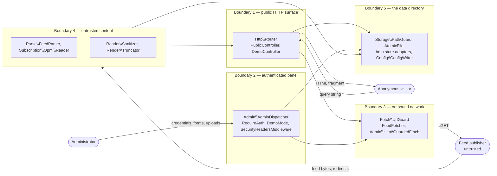

# Threat model

What zFeeder 2.0 defends against, how each defence is implemented, which test
proves it, and what is deliberately left undefended.

This is the document [SECURITY.md](../SECURITY.md) and [README.md](../README.md)
point at. `SECURITY.md` is the disclosure policy; this is the analysis. The
controls are numbered S1–S18 after section B6 of `project/PLAN.md`, so the plan,
the tests and this table use the same identifiers.

**Status note.** `tests/Security/` holds one class per control — `S01…` to
`S18…` — on top of `tests/Security/SecurityTestCase.php`. The suite is 484 tests
and 6,478 assertions and passes:

```bash
vendor/bin/phpunit --testsuite security      # OK (484 tests, 6478 assertions)
./tools/check-forbidden.sh                   # check-forbidden: clean
composer audit                               # No security vulnerability advisories found.
```

Every test named in the table below exists today. The "Test" column names the
dedicated class first and the older tests in `tests/Unit/`,
`tests/Integration/` and `tests/Cli/` afterwards, because several controls are
proven from both directions. Re-check with
`vendor/bin/phpunit --testsuite security --list-tests` before relying on any of
it.

> A one-page picture of the boundaries and the control standing at each one is in
> [diagrams/07-trust-boundaries.svg](diagrams/07-trust-boundaries.svg).

## Contents

- [Assets](#assets)
- [Actors](#actors)
- [Trust boundaries and data flow](#trust-boundaries-and-data-flow)
- [STRIDE per boundary](#stride-per-boundary)
- [Controls S1–S18](#controls-s1s18)
- [Four defects found in 2.0 and closed](#four-defects-found-in-20-and-closed)
- [Residual risk](#residual-risk)
- [The 1.6 defect catalogue](#the-16-defect-catalogue)

## Assets

| Asset | Where it lives | Why it matters |
|---|---|---|
| The administrator credential | `admin_password_hash` in `data/config.json` or `ZF_ADMIN_PASSWORD_HASH` | Whoever has it owns every subscription and every rendered page |
| The admin session | A PHP session, named by `session_name` (default `zfsid`) | Equivalent to the credential while it lasts |
| Subscriptions | `data/categories/*.opml`, or the `categories` and `feeds` tables | The product's data; also a list of URLs the server will fetch |
| Configuration | `data/config.json` | Controls the address guard, the sanitiser policy and the panel |
| Feed cache | `data/cache/`, or the `cache` table | Bodies fetched from third parties; hostile content by assumption |
| Rate-limit records | One JSON file per hashed key, under the data directory | Their absence re-enables password guessing |
| The log | `log_path`, default `data/zfeeder.log` | Contains URLs and error text |
| The host page | Not zFeeder's, but zFeeder writes into it | An XSS in embedded output is an XSS in someone else's site |
| The server's network position | — | Reachable internal services are the SSRF prize |

## Actors

| Actor | Trusted? | Can do |
|---|---|---|
| Anonymous visitor | No | Any request to any public route with any query string |
| Administrator | Yes, once signed in | Everything the panel offers, including choosing which URLs the server fetches |
| Feed publisher | **No** | Controls the bytes of a subscribed feed: its markup, its dates, its redirects, its size, its response times, and the DNS answers for its host |
| Operator | Yes | Sets the environment, owns the filesystem, runs the CLI |

The feed publisher being untrusted is the whole design constraint. An
administrator subscribes to a feed because they like its content, not because
they vouch for its author.

## Trust boundaries and data flow



Five boundaries, each with one question:

1. **Public HTTP surface.** Can a query string make the program do something it
   should not — read a file outside the template directory, name a category
   outside the data directory, or trigger a refresh without the key?
2. **Authenticated panel.** Can an unauthenticated request reach a screen, and
   can another site cause a signed-in browser to submit one?
3. **Outbound network.** Can an attacker-chosen URL make the server open a
   connection it should not open, or read something that is not a socket?
4. **Untrusted content.** Can bytes from a publisher become script in the host
   page, an entity expansion, a local file read, or unbounded memory use?
5. **Data directory.** Can anything under it be written outside it, executed,
   left half-written, or read by another user on the host?

## STRIDE per boundary

### Boundary 1 — public HTTP surface

| | Threat | Answer |
|---|---|---|
| **S**poofing | An anonymous request claims HTTPS, or claims to be a proxy | `Http\SecurityHeaders::trustsProxy()` believes `X-Forwarded-Proto` only when `trusted_proxies` names the peer or is `*` |
| **T**ampering | `zfcategory` or `zftemplate` escapes the directory | `Category::isValidName()` and `Render\TemplateLocator::resolve()`, then `realpath()` containment |
| **R**epudiation | — | Public reads are not attributed; `Log\FileLogger` records failures only |
| **I**nformation disclosure | A stack trace or path in an error page; OPML export left open | `Http\ErrorHandler` returns a status and a fixed sentence in production; `/api/opml/{category}` is 404 unless `opml_export_public` is on |
| **D**enial of service | `/refresh` used to make the server fetch everything repeatedly | `PublicController::refresh()` needs `refresh_key`, compared with `hash_equals()`; unset means the endpoint is closed. `Integration\Http\EmbedEndpointsTest::testRefreshingOverHttpNeedsTheKey`, `testRefreshingWithTheKeyPrintsThe2004Report` |
| **E**levation | A public route reaching an admin action | Handler names are matched by prefix; `AdminRoutes` registers writes as POST routes only |

### Boundary 2 — authenticated panel

| | Threat | Answer |
|---|---|---|
| **S**poofing | Password guessing; session fixation | Argon2id with a decoy hash for unknown users (`Admin\Auth\PasswordHasher`), `Admin\Auth\RateLimiter`, `SessionAuth` regenerates the id on sign-in |
| **T**ampering | Another site posting a form to the panel | `Admin\Auth\Csrf`, checked by `AbstractController::csrfValid()` on every mutating request; a missing token fails like a wrong one |
| **R**epudiation | — | Single-account product; the log records sign-in failures |
| **I**nformation disclosure | Session cookie read by script or sent cross-site | `HttpOnly`, `SameSite=Lax`, `Secure` on HTTPS; `PhpSession` sets `use_strict_mode` and `use_only_cookies` |
| **D**enial of service | Repeated Argon2id verifications | `RateLimiter` refuses before the hash is computed |
| **E**levation | Reaching a screen without signing in; writing in demo mode | `Middleware\RequireAuth`; `Middleware\DemoMode` refuses every unsafe method except sign-in and sign-out |

### Boundary 3 — outbound network

| | Threat | Answer |
|---|---|---|
| **S**poofing | A public name resolving to a private address | `UrlGuard` resolves the name and checks **every** A and AAAA record |
| **T**ampering | A redirect to an internal address after a public first hop | `Kernel::httpClient()` sets `max_redirects: 0`; `FeedFetcher::followRedirects()` re-runs the guard on each hop |
| **R**epudiation | — | `FileLogger` records every fetch failure with its URL |
| **I**nformation disclosure | `file://`, `php://filter` or the cloud metadata endpoint | Scheme allow-list of `http` and `https`; `169.254.169.254` is named and refused with its own reason |
| **D**enial of service | An endless or enormous response | `fetch_max_bytes` counted while streaming, `fetch_timeout`, `fetch_max_redirects`; `GuardedFetch` applies the same rules with three redirects |
| **E**levation | Reaching an internal service that trusts its network | The address tables in `UrlGuard::BLOCKED_V4` and `BLOCKED_V6`, plus the IPv4-in-IPv6 unwrapping |

### Boundary 4 — untrusted content

| | Threat | Answer |
|---|---|---|
| **S**poofing | A feed claiming another feed's identity | Not defended, and not defensible: the subscription URL is the identity |
| **T**ampering | Feed text containing `{token}` and being expanded | `Render\Tokens::substitute()` runs on the template text before any value is substituted, so a value can never be re-scanned |
| **R**epudiation | — | — |
| **I**nformation disclosure | XXE reading a local file | `Parse\FeedParser` refuses any document type declaration carrying or naming an external resource; `Opml\Reader` refuses every DTD |
| **D**enial of service | Billion laughs; a whole article per item | Entity expansion is refused before parsing; `Opml\Reader::MAX_BYTES` (4 MiB) and `MAX_OUTLINES` (500); `max_description_chars`; the sanitiser caps input at 5 MB |
| **E**levation | Script in the host page | `Render\Sanitizer`: allow-list elements, dangerous containers dropped with their contents, no `style` attribute, no `data:` media, link schemes limited to http/https/mailto |

### Boundary 5 — the data directory

| | Threat | Answer |
|---|---|---|
| **S**poofing | — | — |
| **T**ampering | A half-written OPML file after an aborted request | `Storage\AtomicFile`: temporary file, lock, `rename()` |
| **R**epudiation | — | — |
| **I**nformation disclosure | The data directory served over HTTP | `ConfigLoader::assertDataOutsideWebRoot()` refuses at boot; `data-dist/.htaccess` denies access if it is placed there anyway |
| **D**enial of service | The cache growing without bound | `bin/zfeeder purge` and `CacheStoreInterface::purge()` |
| **E**levation | Configuration becoming executable code | `Config\ConfigWriter` writes JSON and only JSON; there is no code path that writes PHP |

## Controls S1–S18

The "1.6 defect closed" column refers to the catalogue at the end of this
document.

| # | Control | Implemented in | Test | 1.6 defect closed |
|---|---|---|---|---|
| S1 | Argon2id password hash, constant-time verification, decoy hash for an unknown user | `src/Admin/Auth/PasswordHasher.php` (`memory_cost` 65536, `time_cost` 4, `MIN_LENGTH` 12) | `Security\S01PasswordHashingTest` (10 tests), including `testTheHashIsArgon2idAndIsNeverThePasswordItself`, `testAnMd5OrSha1DigestOfThePasswordNeverVerifies`, `testNoMd5OrSha1OfAPasswordExistsAnywhereInTheSourceTree`, `testAnEmptyConfiguredHashDisablesThePanelEntirely`; `Integration\Admin\LoginTest`; `Cli\HashPasswordCommandTest` | L1 |
| S2 | Login rate limit, sliding window, file-backed | `src/Admin/Auth/RateLimiter.php`, `login_max_attempts` / `login_window_seconds` | `Security\S02LoginRateLimitTest` (8 tests), including `testTheAttemptAfterTheLimitIsRefusedWith429AndARetryAfterHeader`, `testTheThrottleRefusesEvenTheCorrectPassword`, `testTheLimitIsPerIdentitySoASecondAddressIsUnaffected`, `testTheCounterIsStoredUnderAHashedKeySoTheAddressNeverBecomesAFileName`; `Integration\Admin\LoginTest::testTooManyAttemptsAreThrottled` | L2 |
| S3 | Session id regenerated on sign-in, `HttpOnly`, `SameSite=Lax`, `Secure` on HTTPS, idle timeout | `src/Admin/Auth/SessionAuth.php`, `src/Admin/Auth/PhpSession.php` (`use_strict_mode`, `use_only_cookies`, `sid_length` 48) | `Security\S03SessionTest` (12 tests), including `testTheSessionIdentifierChangesOnASuccessfulSignIn`, `testTheCookieIsHttpOnlyAndSameSiteLax`, `testSecureIsSetOverHttpsAndNotOverPlainHttp`, `testAForwardedProtocolAloneDoesNotEarnASecureCookie`, `testAnIdleSessionIsSignedOut`; `Integration\Admin\LoginTest` | L3, L4 |
| S4 | CSRF token per session on every mutating request; GET never mutates | `src/Admin/Auth/Csrf.php`, `src/Admin/Controller/AbstractController.php::csrfValid()`, route split in `src/Admin/AdminRoutes.php` | `Security\S04CsrfTest` (46 tests), including `testATokenFromAnotherSessionIsRefusedAndNothingChanges`, `testATokenThatDiffersInOneCharacterIsRefused`, `testTheComparisonIsHashEqualsAndNotAStringComparison`, `testTheTokenIsRotatedOnSignInSoAPreSessionTokenIsWorthless`, `testNoGetRouteMutatesState`, `testEveryWriteHandlerIsReachableOnlyByPost`; `Integration\Admin\CsrfProtectionTest` (18 tests) | L5 |
| S5 | Allow-list HTML sanitiser; `javascript:` and `data:` removed; item body truncated; channel strings escaped once; feed URLs scheme-checked | `src/Render/Sanitizer.php`, `src/Render/Truncator.php`, `Renderer::itemBody()`, `Renderer::present()` with `Renderer::PRE_FORMED`, `Renderer::safeUrl()` with `Renderer::SAFE_SCHEMES`, `Tokens::substitute()` with `Tokens::RAW_BY_DEFAULT` | `Security\S05SanitizerTest` (87 tests), including `testEveryRecordedPayloadIsNeutralised`, `testWithoutTheSanitiserEveryOneOfThosePayloadsWouldReachThePage`, `testHostileChannelMetadataIsEscapedBeforeItReachesThePage`, `testTheSelfBuiltTokensAreNotEscapedASecondTime`, `testAFeedSuppliedLinkWithAnUnsafeSchemeBecomesADeadLink`, `testEveryUnsafeSchemeIsRefusedInAFeedLink`, `testARelativeFeedLinkIsKeptBecauseItCannotExecute`, `testTheChannelLogoUrlsAreSchemeCheckedLikeEveryOtherFeedLink`, `testTheLegacyFidelityModeIsTheOnlyWayBackToThe2004Behaviour`; `Unit\Render\SanitizerTest` (23), `Unit\Render\RendererTest` | L6 |
| S6 | Address guard: scheme allow-list, every resolved address checked, re-checked per redirect, byte ceiling, timeout | `src/Fetch/UrlGuard.php`, `src/Fetch/FeedFetcher.php`, `src/Admin/Http/GuardedFetch.php` | `Security\S06UrlGuardTest` (62 tests), including `testAChainOfPublicHopsEndingAtLoopbackIsStillRefused`, `testARelativeRedirectCannotSmuggleAnAddressPastTheGuard`, `testEvenWithPrivateHostsAllowedAFileUrlIsStillRefused`, `testAutodiscoveryRefusesAForbiddenAddress`, `testImportingAListFromAnAddressThatRedirectsInwardsIsRefused`; `Unit\Fetch\UrlGuardTest` (62), `Unit\Fetch\FeedFetcherTest` (34), `Integration\Admin\AddFeedScreenTest`, `Cli\AddFeedCommandTest` | L7, L8 |
| S7 | Name pattern plus `realpath()` containment for categories, templates and sets | `src/Subscription/Category.php` (`NAME_PATTERN`), `src/Render/TemplateLocator.php`, `src/Storage/PathGuard.php` | `Security\S07PathTraversalTest` (86 tests), including `testACategoryThatIsASymlinkPointingOutOfTheDirectoryIsRefused`, `testThePathGuardFollowsASymlinkBeforeJudgingIt`, `testTheAdminExportRouteAnswers4xxForATraversalCategory`, `testTheDemoTemplateRouteNeverAnswers200WithAFileFromElsewhere`; `Unit\Render\TemplateLocatorTest` (16), `Unit\Storage\FlatSubscriptionStoreTest`, `Unit\Storage\SqliteSubscriptionStoreTest` | L9, L10 |
| S8 | Configuration is JSON in the data directory, never PHP; unknown keys rejected; data directory refused under the web root | `src/Config/ConfigWriter.php`, `src/Config/Schema.php`, `src/Config/ConfigLoader.php` | `Security\S08ConfigIsNotPhpTest` (19 tests), including `testAHostileValueRoundTripsAsDataAndNeverBecomesCode`, `testNothingInTheSourceTreeEverWritesPhp`, `testADataDirectoryInsideTheWebRootIsRefusedAtBoot`, `testAFailedWriteLeavesThePreviousFileIntact`, `testValuesThatCameFromTheEnvironmentAreNeverPersisted`; `Unit\Config\ConfigWriterTest` (9), `Unit\Config\ConfigLoaderTest` (40) | L11, L12 |
| S9 | XXE off, document type declarations refused, size cap before parsing | `src/Parse/FeedParser.php` (`assertSafeXml()`, `HISTORIC_DOCTYPE_IDS`), `src/Subscription/Opml/Reader.php` (`MAX_BYTES`) | `Security\S09XmlTest` (14 tests), including `testTheNaiveParserReallyDoesLeakALocalFile` and `testTheFeedParserRefusesTheXxePayloadAndReadsNoLocalFile` as a pair, `testBillionLaughsIsRefusedWithoutExpandingAnything`, `testAnExternalDtdReferenceCausesNoNetworkRequest`, `testTheOpmlReaderLeavesNoExternalEntityLoaderBehind`; `Unit\Parse\FeedParserTest` (64), `Unit\Subscription\OpmlReaderTest` (36) | L13 |
| S10 | Response headers: admin CSP with a per-request nonce, configurable `frame-ancestors` for the embed, `X-Content-Type-Options`, `Referrer-Policy`, `Permissions-Policy`, `Cross-Origin-Opener-Policy`, HSTS on HTTPS | `src/Http/SecurityHeaders.php`, `src/Admin/Middleware/SecurityHeadersMiddleware.php` | `Security\S10SecurityHeadersTest` (16 tests), including `testEveryPanelScreenCarriesTheFullSetOfHeaders`, `testTheNonceIsDifferentOnEveryRequestAndIsTheOneOnThePage`, `testThePublicSideHasItsOwnPolicy`, `testTheEmbedPolicyHonoursTheConfiguredFrameAncestors`, `testAForwardedProtocolIsBelievedOnlyWhenAProxyIsDeclared`, `testTheFrontControllerAppliesAPolicyToEveryPublicRoute`; `Integration\Http\HttpHardeningTest`, `Integration\Admin\ScreenAccessTest` | L14 |
| S11 | OPML import guard: the URL passes the address guard, at most 500 outlines | `src/Subscription/Opml/Reader.php::MAX_OUTLINES`, `src/Admin/Controller/ImportController.php` | `Security\S11OpmlImportGuardTest` (9 tests), including `testTheReaderItselfCountsOutlinesBeforeBuildingAnything`, `testARemoteImportGoesThroughTheAddressGuard`, `testAnImportThatFailsLeavesTheExistingCategoryExactlyAsItWas`, `testAnImportedListCannotRenameItselfOntoAnotherCategory`; `Unit\Subscription\OpmlReaderTest`, `Integration\Admin\ImportScreenTest`, `Cli\ImportCommandTest` | L15 |
| S12 | CORS only for configured origins; JSON encoded with the HEX flags and invalid UTF-8 substituted | `src/Http/SecurityHeaders.php::forEmbed()`, `src/Http/Responder.php::json()` | `Security\S12EmbedCorsTest` (22 tests), including `testAnUnconfiguredOriginGetsNoCorsHeaderAtAll`, `testANearMissOriginIsRefused`, `testTheWildcardIsNeverEchoedEvenWhenItIsConfigured`, `testHostileFeedTextCannotBreakOutOfTheJsonStructure`, `testTheJsonBodyCannotCloseAScriptElement`, `testInvalidUtf8FromAFeedCannotBreakTheEncoding`; `Integration\Http\HttpHardeningTest::testTheEmbedEndpointAnswersCrossOriginOnlyForAConfiguredOrigin`, `Integration\Http\EmbedEndpointsTest` | — (new surface) |
| S13 | Demo mode refuses every unsafe method | `src/Admin/Middleware/DemoMode.php`, `AdminRoutes::DEMO_EXEMPT_HANDLERS` | `Security\S13DemoModeTest` (30 tests), including `testEveryWriteIsRefusedAndTheDataDirectoryIsUntouched`, `testTheSameWriteSucceedsWhenDemoModeIsOff`, `testTheExemptionsAreExactlySignInAndSignOut`, `testAnHtmxWriteIsRefusedWithAPlainSentenceRatherThanAPage`; `Integration\Admin\DemoModeTest` (10) | — (new surface) |
| S14 | Static rules: no `eval`, no `create_function`, no shell execution, no `unserialize`, no `extract`, no dynamic include, no remote `file_get_contents`/`readfile`/`fopen`, no `md5`/`sha1` on anything named like a password, no blanket error suppression | `tools/check-forbidden.sh`, run by the **Lint and static analysis** job in `.github/workflows/ci.yml`; plus `phpstan` level 8 with strict rules and `deptrac` | `Security\S14ForbiddenConstructsTest` (5 tests): `testTheForbiddenConstructCheckerRunsAndReportsNothingNew` runs the script itself, `testTheCheckerStillCarriesEveryRuleItIsSupposedTo` and `testEveryRuleStillMatchesTheConstructItBans` prove the rules have not been quietly weakened, `testNoRuleFiresOnOrdinaryCode` bounds the false-positive rate. The script exits 0 — see the note below | L16 |
| S15 | OPML upload capped at 1 MiB and checked as it is read | `src/Admin/Controller/ImportController.php::MAX_UPLOAD_BYTES` (1048576), with the same ceiling passed to `GuardedFetch` for a URL import | `Security\S15UploadLimitsTest` (23 tests), including `testAnUploadThatLiesAboutItsSizeIsStillRefusedByMeasurement`, `testTheClientsContentTypeIsNeverConsulted`, `testAPhpScriptUploadedAsAListIsNeverWrittenAnywhere`, `testTheCeilingIsTheSameForAnUploadAndForAUrlImport`; `Integration\Admin\ImportScreenTest` | — (new surface) |
| S16 | The error handler never leaks a path or a trace in production, logs a refusal as well as a failure, and answers 404 for a template that does not exist | `src/Http/ErrorHandler.php` (detail only when `isProduction()` is false; `notice` below 500 and `error` at 500 and above; `TemplateException` → 404), boot failure in `public/index.php` prints one sentence and logs the rest | `Security\S16ErrorHandlerTest` (22 tests), including `testProductionLeaksNoPathClassNameOrStackFrame`, `testProductionLeaksNothingThroughTheJsonShapeEither`, `testTheDetailIsEscapedInDevelopmentSoAMessageCannotBecomeMarkup`, `testAServerErrorIsLoggedInEveryEnvironment`, `testARefusedRequestIsRecordedForTheOperator`, `testTheBootFailureBranchPrintsOneSentenceAndLogsTheRest`, `testNoErrorPathAnywhereInTheSourceTreePrintsATrace`; `Integration\Admin\ConfigScreenTest::testTheSecretsAreNeverPrintedBack`, `Cli\CheckConfigCommandTest` | L17 |
| S17 | Dependency audit and SBOM | `composer audit` in the **Dependency and secret scan** job of `.github/workflows/ci.yml`; `tools/sbom.php` writes CycloneDX 1.5 from `composer.lock`, attached by `.github/workflows/release.yml` | `Security\S17DependencyAuditTest` (5 tests): `testComposerAuditReportsNoAdvisory` runs `composer audit`, `testTheSbomToolProducesValidCycloneDx`, `testTheSbomListsEveryRuntimeDependencyInTheLockFile`, `testTheSbomDoesNotListDevelopmentOnlyDependencies`, `testEveryRuntimeDependencyIsPinnedToAnExactVersion` | — |
| S18 | No secrets in the repository | `gitleaks/gitleaks-action@v2` in the same CI job, with `fetch-depth: 0` | `Security\S18SecretsTest` (8 tests): `testTheScannerRecognisesASecretWhenItSeesOne` proves the scan is not vacuous, then `testNoSecretIsCommittedAnywhereInTheWorkingTree`, `testNoEnvFileIsPresentOrTrackable`, `testTheShippedConfigurationTemplateCarriesNoCredential`, `testNoShippedScriptCarriesAPasswordHash`, `testCiStillScansTheHistoryForSecrets` | L18 |

`.github/workflows/codeql.yml` runs CodeQL over the tree as a fourth check
alongside PHPStan, deptrac and the forbidden-construct script.

`./tools/check-forbidden.sh` prints `check-forbidden: clean` and exits 0. Its
two over-broad patterns — "shell execution" matching the `exec` in
`$pdo->exec(...)`, and an error-suppression allow-list that omitted
`file_get_contents` — were tightened, so the eleven matches it used to report
are gone. `Security\S14ForbiddenConstructsTest` now runs the script as part of
the suite, and separately asserts that every rule still fires on the construct
it bans, so tightening a pattern cannot silently disable it.

## Four defects found in 2.0 and closed

These were found after the analysis above was first written, by reviewing the
render path against the boundary-4 question rather than by a report from
outside. Each has a test that fails without the fix.

| # | What was wrong | What it is now | Test |
|---|---|---|---|
| 1 | Channel strings taken from a feed — `{chantitle}`, `{chandesc}`, `{category}`, and an item's `{title}` and `{pubdate}` — reached the page unescaped, so a hostile `<title>` was markup in the host page | Escaped exactly once: `Renderer::present()` escapes for the 1.6 `str_replace()` pass, `Tokens::substitute()` escapes for the filter pass. `Renderer::PRE_FORMED` (`chanlogo`, `moreurl`, `hideurl`, `lastupdated`, `scripturl`) and `Tokens::RAW_BY_DEFAULT` (`description`, `chanlogo`) name the tokens the renderer or the sanitiser built itself, which are **not** escaped a second time — doing so would print `&amp;` in a URL and the literal source of the logo markup | `S05SanitizerTest::testHostileChannelMetadataIsEscapedBeforeItReachesThePage`, `testTheSelfBuiltTokensAreNotEscapedASecondTime`, `testAHostileItemTitleAndBodyAreNeutralisedInTheRenderedPage` |
| 2 | Feed-supplied URLs were escaped but not scheme-checked. `htmlspecialchars('javascript:alert(1)')` is unchanged, and the browser still runs it when the link is followed — escaping is not a defence for an `href` | `{chanlink}`, `{feedurl}`, an item's `{link}` and both URLs inside `{chanlogo}` go through `Renderer::safeUrl()`, which strips `\x00-\x20` (a newline or tab inside the word `javascript` is the classic bypass) and then allows only `Renderer::SAFE_SCHEMES` — `http`, `https`, `mailto` — or a relative reference with no scheme at all. Anything else becomes the empty string: a dead link, not an executable one | `S05SanitizerTest::testAFeedSuppliedLinkWithAnUnsafeSchemeBecomesADeadLink`, `testEveryUnsafeSchemeIsRefusedInAFeedLink`, `testARelativeFeedLinkIsKeptBecauseItCannotExecute`, `testAnOrdinaryFeedLinkIsStillRendered`, `testTheChannelLogoUrlsAreSchemeCheckedLikeEveryOtherFeedLink`, `testAnOrdinaryChannelLogoSurvivesTheCheck` |
| 3 | `Responder::json()` encoded with the readable flags only. `/api/feeds` is served as `application/json`, but a caller who drops the body into a `<script>` block — which is what a JSONP-shaped integration does — could be handed a feed title containing `</script>` | `JSON_HEX_TAG\|JSON_HEX_AMP\|JSON_HEX_APOS\|JSON_HEX_QUOT` are set alongside `JSON_INVALID_UTF8_SUBSTITUTE`, so `<`, `>`, `&`, `'` and `"` leave as `\u00xx` escapes and no feed string can terminate an element or an attribute | `S12EmbedCorsTest::testTheJsonBodyCannotCloseAScriptElement`, `testHostileFeedTextCannotBreakOutOfTheJsonStructure`, `testInvalidUtf8FromAFeedCannotBreakTheEncoding` |
| 4 | `ErrorHandler` logged only 5xx, at error level, so a probe that produced a 400 or a 404 left no trace; and a `TemplateException` — which is what a template name that does not exist, or a traversal attempt in one, produces — was reported as a 500, blaming the server for a bad request | Below 500 the handler logs at **notice** level with the status, the class and the file, so a run of refusals is visible to an operator without a single refusal paging anyone; at 500 and above it still logs at **error**. `statusFor()` maps `SecurityException` → 400 and `TemplateException` → 404 | `S16ErrorHandlerTest::testARefusedRequestIsRecordedForTheOperator`, `testAServerErrorIsLoggedInEveryEnvironment`, `testANotFoundAndAMethodNotAllowedAreBothPlain` |

### `legacyFidelity` is not a way round any of this

`RenderRequest::$legacyFidelity` turns escaping and scheme checking off and
restores the 2004 behaviour exactly — `htmlspecialchars()` with `ENT_COMPAT |
ENT_HTML401` where 1.6 called it, and nothing at all where 1.6 called nothing.
It exists so `tests/Golden/` can compare byte for byte against output captured
from 1.6 on PHP 5.6.

**No served request can set it.** `grep -rn legacyFidelity src/ public/
zfeeder.php` finds only the declaration on `RenderRequest` and the reads inside
`Renderer`: no route, no query parameter, no configuration option and no CLI
flag ever sets it true. The only callers that do are
`Golden\ClassicTemplateGoldenTest`, `Security\S05SanitizerTest` and
`Unit\Render\RendererTest`, which set it to show what it changes. Reading the escaping code, keep
the two paths apart: everything in this document describes the non-legacy path,
which is the one every visitor gets.
`S05SanitizerTest::testTheLegacyFidelityModeIsTheOnlyWayBackToThe2004Behaviour`
pins that distinction.

## Residual risk

These are known, accepted and not defended against. Stating them is the point of
the section.

**A hostile administrator.** The administrator chooses which URLs the server
fetches and which templates render. A template is a file with `{token}`
substitution and a closed filter list — there is no expression language and no
`eval`, so a template cannot execute code — but an administrator can still point
the server at any public URL, put arbitrary HTML in the `header` section of a
template, and read every subscription. There is one account by design. If you do
not trust the person holding it, do not give them the panel.

**A compromised host.** The data directory is readable by the web server user, so
an attacker with code execution as that user has the configuration, the session
files and the cache. Nothing here defends against that, and the Argon2id hash
only slows down offline cracking of the password afterwards.

**Resource exhaustion from a large subscription list.** A refresh is a loop in
one process. Five hundred subscriptions with a ten-second timeout is, in the
worst case, a very long request. Per-feed limits exist (`fetch_timeout`,
`fetch_max_bytes`) but there is **no** global cap on how long a refresh may take
or how many feeds a category may hold beyond the 500-outline import limit. Run
`refresh_mode=offline` with cron on a large installation; see
[RUNBOOK.md](RUNBOOK.md).

**Feed publishers learn the server's address.** Fetching a feed reveals the
server's IP address, its user agent (`fetch_user_agent`) and the times at which
it polls. That is inherent to being an aggregator. Nothing is proxied and no
attempt is made to hide it.

**DNS rebinding between the check and the connection.** `UrlGuard` resolves the
name and checks every record, but Symfony's HTTP client resolves the name again
when it connects, so a record set that changes in between can direct one request
to an internal address. This is documented in the class docblock. The remaining
exposure is a single outbound request with no path for the response body to reach
the client: a fetch that returns something which is not a feed is logged and
discarded. Closing it completely needs connection-level address pinning, which
the client does not expose.

**Timing and cache-state oracles.** Whether a feed is in the cache is observable
through response time. It is not a secret worth defending.

**The legacy fidelity mode.** `Render\RenderRequest::$legacyFidelity` passes feed
text through without the sanitiser or the truncator, exactly as 1.6 did. It
exists so that `tests/Golden/ClassicTemplateGoldenTest.php` can prove byte
equality with the 2004 output, and it is off in every other code path: no route,
no CLI command and no configuration key turns it on. If you enable it in your own
code, you have re-opened defect L6.

**A small 2004 corpus is in the repository.** The 1.6 application code is no longer
here; it is archived as `zfeeder-1.6.zip` at
<https://github.com/andreibesleaga/old-projects>, with all of the defects below. What
remains is `tests/fixtures/legacy-1.6/`: the eleven original OPML category files and
1.6's `config.php`, which the tests read as text and never execute. The release
archive and the container image, built by `tools/build-dist.sh` and
`deploy/Dockerfile`, do not carry it.

## The 1.6 defect catalogue

Line references are into the untouched zFeeder 1.6 release of 25 April 2004, archived
as `zfeeder-1.6.zip` at <https://github.com/andreibesleaga/old-projects>, so every row
can be checked.

| # | Defect | Where in 1.6 | Closed by |
|---|---|---|---|
| L1 | The administrator password is an unsalted MD5 digest, compared with `!=` | `newsfeeds/admin.php:26`, `newsfeeds/admin.php:39`, `newsfeeds/includes/adminfuncs.php:23`, `:26`; the default value `d41d8cd98f00b204e9800998ecf8427e` in `newsfeeds/config.php:11` is `md5("")` | S1 |
| L2 | No limit on login attempts anywhere | `newsfeeds/admin.php:36-48` — a failed login prints a page and nothing is recorded | S2 |
| L3 | The plaintext password is stored in the session and re-compared on every request | `newsfeeds/admin.php:44` writes `$_SESSION['admin_pass']`; `newsfeeds/includes/adminfuncs.php:26` reads it back | S3 |
| L4 | The session id is not regenerated on sign-in, and no cookie flags are set | `newsfeeds/admin.php:36` calls `session_start()` with defaults and never `session_regenerate_id()` | S3 |
| L5 | No CSRF token exists. `admin.php` dispatches on `$_GET['zfaction']`, so state-changing screens are reachable by a link | `newsfeeds/admin.php:112-115` | S4 |
| L6 | Feed `<description>` and `<title>` are printed into the page unescaped | `newsfeeds/includes/zfuncs.php` `parseTemplate()`; any subscribed feed could run script on every site embedding zFeeder | S5 |
| L7 | Feeds are fetched with `fopen($url, "r")`, so `file://`, `php://`, `ftp://` and any other stream wrapper are accepted, and redirects are followed with no checks | `newsfeeds/includes/zfuncs.php:281` (`fetchFeed`), and the same pattern at `includes/addnewfeed.php:57` and `:378`, `includes/importlist.php:53`, `includes/adminfuncs.php:124` | S6 |
| L8 | No response size limit and no timeout: `fetchFeed()` loops on `fread()` until the stream ends | `newsfeeds/includes/zfuncs.php:283-290` | S6 |
| L9 | `$_GET['zfcategory']` is concatenated into a filesystem path | `newsfeeds/zfeeder.php:63-64`, and `$_POST['zfcategory']` at `newsfeeds/admin.php:66-68` | S7 |
| L10 | `$_GET['zftemplate']` is concatenated into a filesystem path | `newsfeeds/zfeeder.php:95-96` | S7 |
| L11 | The configuration file is PHP, and the admin panel rewrites it line by line from `$_POST` with no validation or escaping | `newsfeeds/includes/changeconfig.php:35-59` — twenty `fwrite()` calls interpolating request data into `define()` statements | S8 |
| L12 | Configuration, subscriptions and the cache all live inside the web root | `newsfeeds/config.php`, `newsfeeds/categories/`, `newsfeeds/cache/` | S8 |
| L13 | The XML parser is expat with no limits; OPML and feeds are parsed the same way, with no size cap | `newsfeeds/includes/zfuncs.php:45` and `:137` open the file and feed it to the parser | S9 |
| L14 | No security response headers of any kind are emitted | Nothing in `newsfeeds/` calls `header()` except for the 401 challenge at `newsfeeds/admin.php:27` | S10 |
| L15 | OPML import has no outline limit and no size limit | `newsfeeds/includes/importlist.php:53` onwards | S11 |
| L16 | Dynamic `include()` of a path chosen by `$_GET` | `newsfeeds/admin.php:112-115` — the values are compared against a fixed list first, so it is not exploitable as written, but the shape is the hazard | S14 |
| L17 | Errors are suppressed rather than handled: `@` on every file operation, and `error_reporting(E_ALL ^ E_NOTICE)` | `newsfeeds/admin.php:21`; `@$fp = fopen(...)` at `includes/zfuncs.php:45`, `:137`, `:281` | S16 |
| L18 | The credential lives in a file that ships in the archive | `newsfeeds/config.php:11` | S18 |
| L19 | Cache files are written world-writable | `newsfeeds/includes/zfuncs.php:296` — `@chmod($to, 0766)`. The `0777` calls at `newsfeeds/zfeeder.php:111-112` and `:131-132` are commented out in the released source | S8, and `Storage\AtomicFile` (`0640` files, `0750` directories) |
| L20 | The cache file name embeds the feed URL and is not injective | `newsfeeds/includes/zfuncs.php:303-306` — `url2file()` uses `ereg_replace("[^[:alnum:]]", "_", $url)`, so two different URLs can collide | `Storage\Flat\FileCacheStore` keys on `sha256(url)`; `Legacy\LegacyCacheLocator` reads the old scheme without writing it. Proven by `Unit\Legacy\LegacyCacheLocatorTest::testTheLegacySchemeCollidesForDifferentUrls` |
| L21 | The update check reads a remote PHP page straight into the admin output | `newsfeeds/admin.php:123` — `@$update = readfile('http://zvonnews.sourceforge.net/latest.php')` | `update_check` is off by default; `src/Admin/Controller/UpdatesController.php` goes through `Admin\Http\GuardedFetch` |
| L22 | HTTP Basic credentials are compared against an MD5 digest on every request, and the "no authentication configured" branch prints a page rather than refusing | `newsfeeds/admin.php:25-33`, `:60-63` | Removed: session login only. HTTP authentication is the web server's job |
