# zFeeder: 2004 → 2026

zFeeder is a PHP RSS aggregator written by Andrei N. Besleaga, started in 2003 under the name zvonFeeds and
renamed zFeeder for its 1.0 release. Hosted on SourceForge as project `zvonnews` (registered 27 June 2003),
it reached version 1.6 on 25 April 2004, where development stopped. At a time when RSS came in several
incompatible versions and there was no standard aggregator, zFeeder let any PHP page show someone else's
feed content with a single `include` line. It stored subscriptions as OPML instead of a database — shared
hosting rarely offered MySQL then — cached feeds to flat files, and rendered them through swappable
templates. It spread through SourceForge, a three-page article (with cover-CD inclusion) in the German
magazine INTERNET PROFESSIONELL in August 2004, and third-party modules for WordPress, PHP-Nuke, XHP and
MovableType. By the author's own account, zFeeder ran on more than 20,000 websites over its lifetime — his
own recollection, not an audited number. The project site eventually went offline; the SourceForge listing
and the original source survive. It has now been rebuilt as zFeeder 2.0: the same architecture and the same
feature set, on PHP 8.3, with the 2004-era security holes closed and each closure held open by a test. The
full story is in [`docs/HISTORY.md`](../HISTORY.md); what 2.0 defends against is in
[`docs/THREAT-MODEL.md`](../THREAT-MODEL.md).

Below, each pair sets a February 2004 screenshot — from the project's own `shots.php`, recovered from the
Internet Archive — next to the same view in 2026.

**What the 2026 column shows.** Every image in it is a capture of the unmodified 1.6 code running on
PHP 5.6 in 2026 against live feeds (`old/screenshots/02-running-now-php56/`). It is **not** a capture of
the 2.0 rebuild. The rebuild exists and is what this repository contains; these images have not yet been
retaken from it. The right-hand column therefore answers "does the 2004 code still run?" rather than
"what does 2.0 look like?" — for the latter, open the live demo below, or run
`tools/run-e2e.sh` and look in `test-results/`.

## Admin panel

| 2004 | 2026 (1.6 code, PHP 5.6) |
|---|---|
|  | 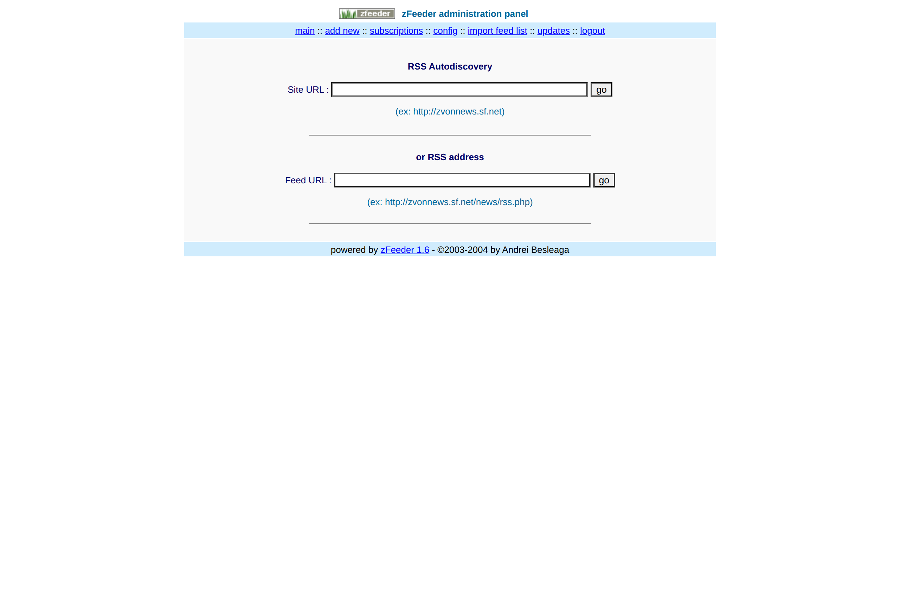 |

**Add new feed.** Same screen: a site URL for autodiscovery or a direct feed URL, plus the bookmarklet.
Functionally unchanged in the PHP 5.6 run. The 2.0 rebuild keeps the same two entry paths and adds what
1.6 had no notion of: a CSRF token on the submission (`src/Admin/Auth/Csrf.php`) and an address guard that
refuses loopback, private and link-local addresses on every redirect hop before anything is fetched
(`src/Fetch/UrlGuard.php`).

| 2004 | 2026 (1.6 code, PHP 5.6) |
|---|---|
|  | 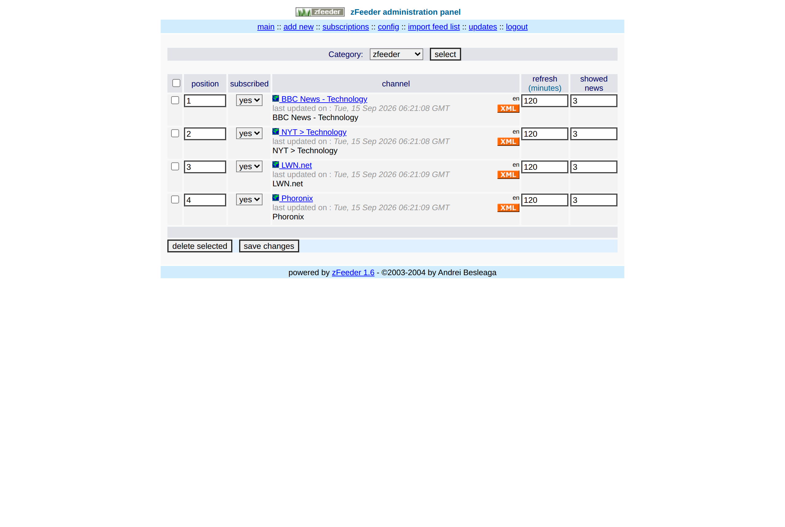 |

**Subscriptions list.** Category selector and the position / subscribed / refresh-time / showed-news
columns per channel, identical between 2004 and the 2026 run — the 2026 subscriptions shown here are live
feeds (BBC, NYT, LWN, Phoronix, and others) substituted for the dead 2004 demo subscriptions, since the
original feed URLs no longer resolve.

| 2004 | 2026 (1.6 code, PHP 5.6) |
|---|---|
|  | 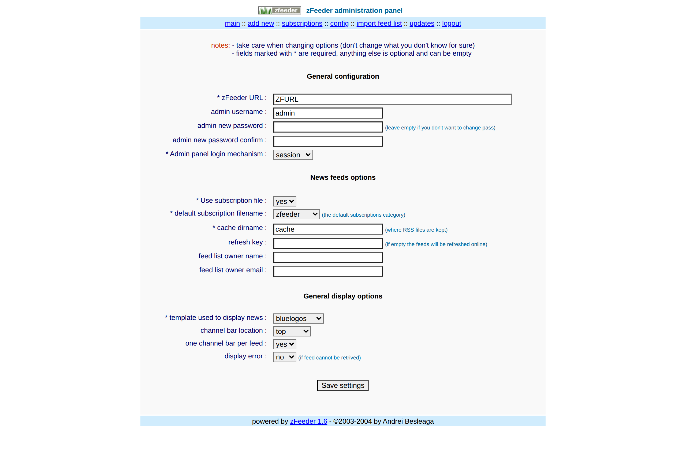 |

**Config panel.** General, feed and display options on one screen. In 1.6 saving this form rewrites
`config.php` as executable PHP built from `$_POST`. The 2.0 rebuild replaces that file with
`data/config.json`, written through an atomic-rename `Config\ConfigWriter`: there is no code path in
`src/` that writes PHP, and `Security\S08ConfigIsNotPhpTest` asserts it. The 44 options are defined once,
in `src/Config/Schema.php`, and `docs/CONFIGURATION.md` is generated from it.

## Output templates and demo pages

| 2004 | 2026 (1.6 code, PHP 5.6) |
|---|---|
|  | 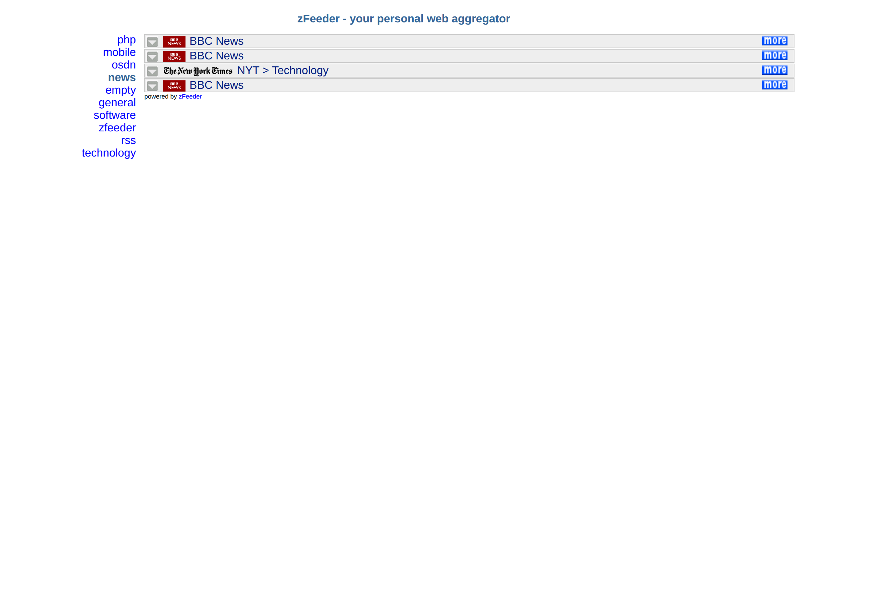 |

**Categories, infojunkie template.** `demo_categories.php`: a category menu with fold/unfold per channel.
Same template, same behaviour, live 2026 feeds.

| 2004 | 2026 (1.6 code, PHP 5.6) |
|---|---|
| 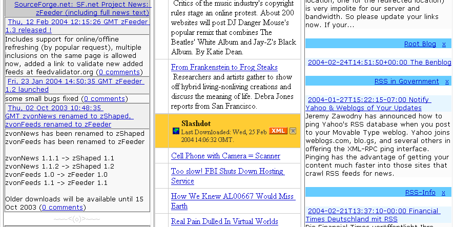 | 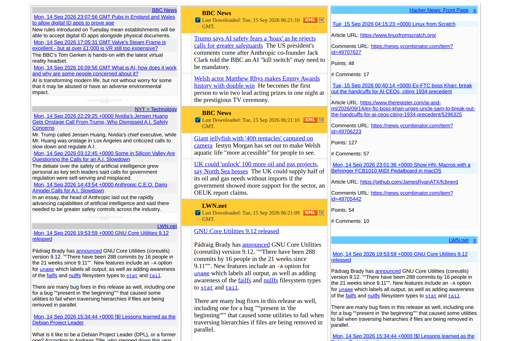 |

**Three templates, one page.** `demo_multiple.php`: three categories rendered with three different
templates side by side, the pattern of including zFeeder more than once on the same page.

| 2004 | 2026 (1.6 code, PHP 5.6) |
|---|---|
| 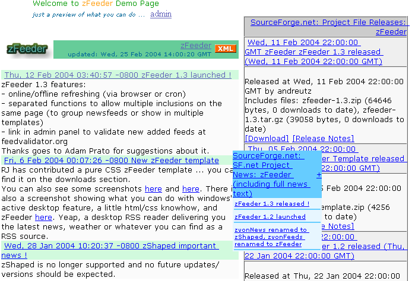 | 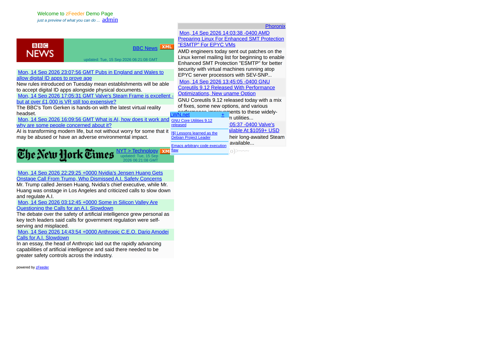 |

**bluelogos with positioned layers.** `demo_positions.php`: the default template combined with absolutely
positioned layers on the page.

| 2004 | 2026 (1.6 code, PHP 5.6) |
|---|---|
| 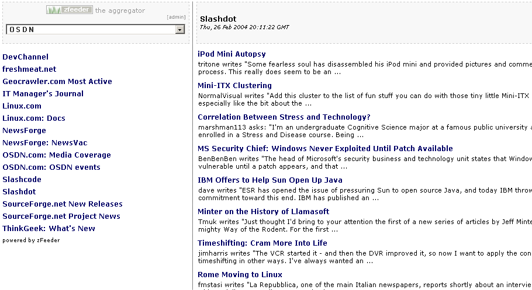 | 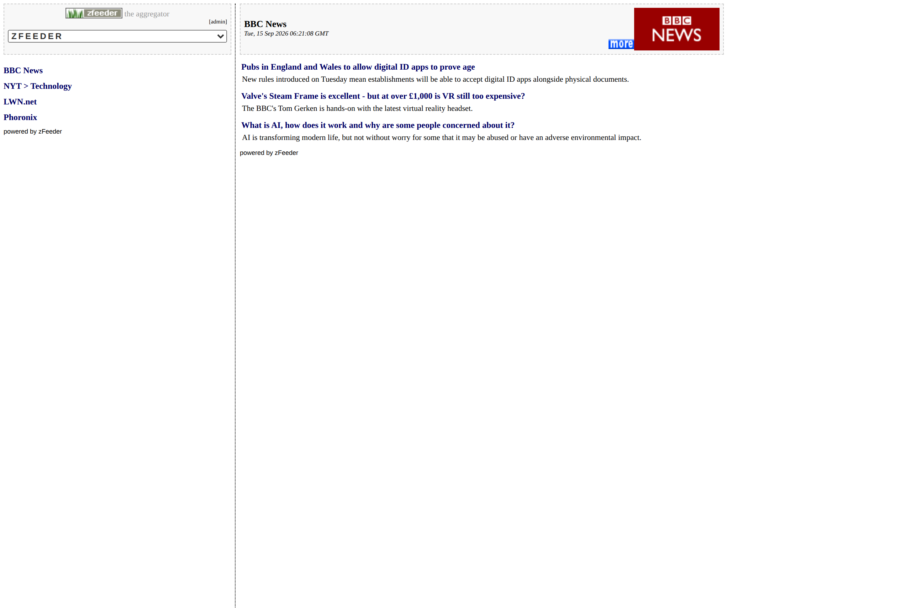 |

**Frames aggregator.** `demo_frames.php`: a sidebar-and-main-frame layout used as a standalone news reader,
referenced from the 1.4 news item as "the aggregator." The 2.0 rebuild retires actual HTML frames and
reproduces the layout with CSS grid, at `/demos/aggregator` on the live demo.

| 2004 | 2026 (1.6 code, PHP 5.6) |
|---|---|
| 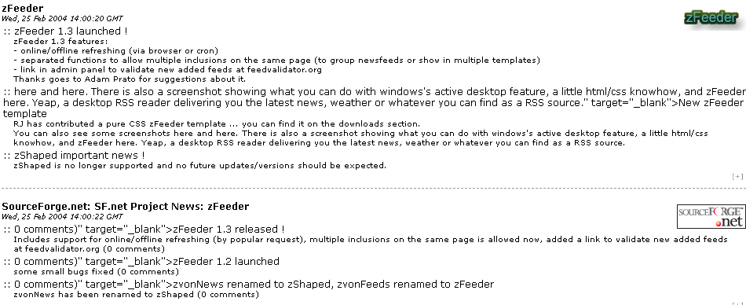 | 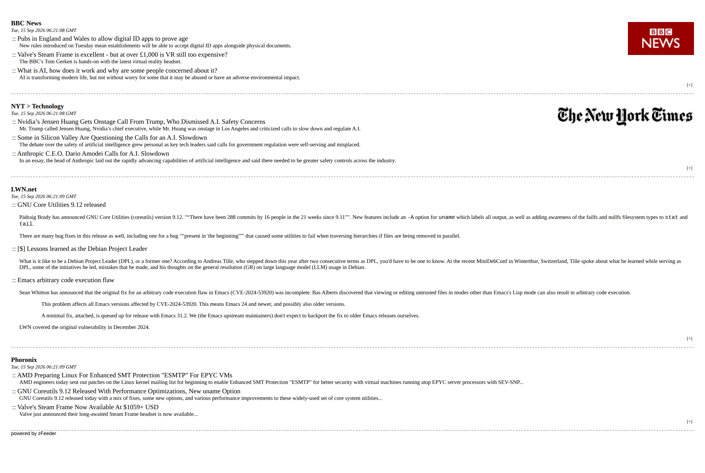 |

**RiJ template.** A pure-CSS template contributed by a user, one of the few 1.6 templates that came from
outside the project rather than from the author.

| 2004 | 2026 (1.6 code, PHP 5.6) |
|---|---|
| 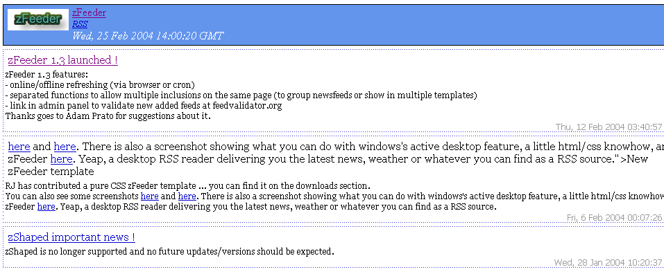 | 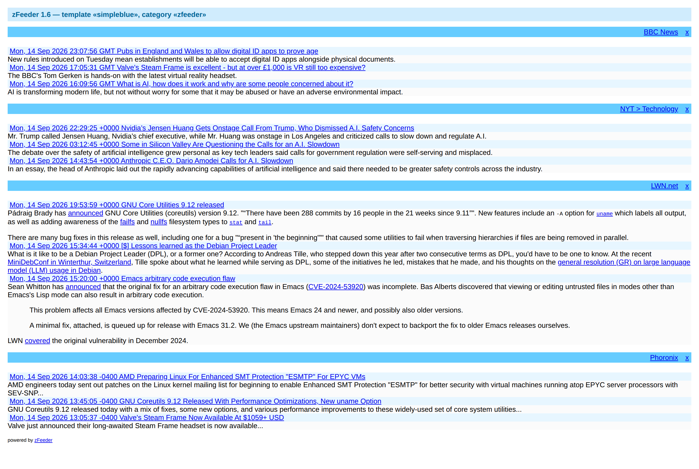 |

**simpleblue template.** One of the plainer bundled layouts, shown here from the 2026 template gallery
capture rather than from a dedicated demo page.

## Links

- Live demo: <https://zfeeder.up.railway.app> — the 2.0 rebuild, with the administration panel in
  read-only demonstration mode
- Source: <https://github.com/andreibesleaga/zfeeder>
- Original project: <https://sourceforge.net/projects/zvonnews/>
